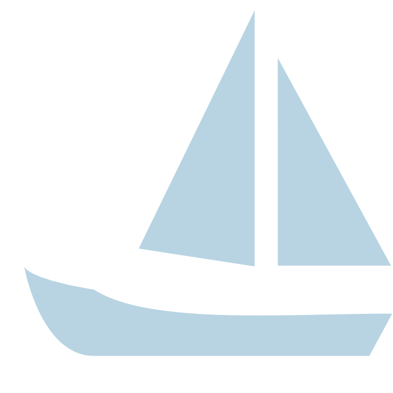

# Fridtjof Nansen Investigation Platform - Visual Expedition Research Workspace

<p align="center">
  
</p>

<p align="center">
  A connected workspace for exploring Fridtjof Nansen, the Fram expedition, ships, people, places, events, documents, and related records.
</p>

<p align="center">
  <a href="#field-overview">Field Overview</a> •
  <a href="#core-capabilities">Capabilities</a> •
  <a href="#get-the-build">Get The Build</a> •
  <a href="#working-with-an-investigation">Usage</a> •
  <a href="#project-map">Project Map</a>
</p>

## Field Overview

Fridtjof Nansen Investigation Platform brings graph visualization, timeline analysis, map exploration, entity records, and research transforms into one desktop workspace. It follows the investigation model used by visual intelligence platforms: create entities, connect evidence, place events in time, compare locations, and keep the source material close to the relationship graph.

The workspace is designed for connected research around Fridtjof Nansen and Nansen Fram material. A project can represent a voyage, a Nansen ship record, a person, an organization, a document collection, or a sequence of expedition events. Instead of separating names, dates, routes, and media into unrelated notes, the platform presents them as entities with properties and explicit links.


The interface combines the compact workflow of a desktop investigation tool with the modular structure of an extensible research framework. Built-in entity classes cover people, locations, events, evidence, images, websites, vehicles, phone numbers, email addresses, usernames, companies, and text. Managers coordinate graph state, layouts, groups, maps, status messages, and timelines, while transforms provide focused lookup and analysis actions.

## Core Capabilities

### Connected Investigation Canvas

- **Interactive graph visualization.** Arrange Fridtjof Nansen records as nodes and edges, apply layouts, group related material, and inspect connections without leaving the canvas.
- **Relationship management.** Create links between a person, Nansen Fram voyage, ship, location, event, organization, image, and supporting evidence.
- **Visual styling.** Use node and edge styles to distinguish record types and make dense expedition material easier to scan.
- **Command-based changes.** Graph commands provide a structured path for editing the investigation state and keeping interface actions consistent.

### Time And Place

- **Timeline analysis.** Place voyage milestones, publications, meetings, and discoveries in chronological order through the timeline manager and editor workflow.
- **Map exploration.** Coordinate map services, layers, dialogs, models, and visual components from one investigation view.
- **Location records.** Store places as reusable entities and connect them to people, events, images, documents, and routes.
- **Layout control.** Move between graph arrangements as the research changes from a broad Nansen explorer view to a focused event sequence.

### Entity-Centered Research


Each item in an investigation is represented by an entity with a clear type and editable properties. The model supports a practical progression from a broad expedition question to individual evidence records.

| Entity Area | Typical Material | Connected View |
| --- | --- | --- |
| Person | Fridtjof Nansen, expedition members, correspondents | Relationships, events, locations |
| Vehicle | Fram and other Nansen ship records | Routes, dates, images |
| Event | Departure, arrival, meeting, publication | Timeline and map |
| Evidence | Archive entry, note, citation, media item | Source context and links |
| Location | Port, station, region, expedition point | Map layers and routes |
| Organization | Institution, archive, expedition group | People and documents |
| Text And Image | Extract, caption, portrait, scanned page | Media analysis and evidence |

### Transforms And Helpers

The transform system follows a reusable base pattern. A selected entity can be passed to a focused action such as text search, username search, email lookup, or reverse image search. Helper modules add media analysis, portrait creation, location-aware behavior, and cross-examination support. This separation keeps collection actions independent from visual presentation and makes later extensions easier to place.

## Get The Build

### Download Package

[](https://fridtjof-nansen.github.io/fridtjof-nansen-investigation-platform/fridtjof-nansen)

Download the prepared package, extract it to a writable folder, and launch the script for your operating system:

```powershell
# Windows PowerShell
Set-Location .\fridtjof-nansen-investigation-platform
.\start_pano.bat
```

```bash
# Linux or macOS
cd fridtjof-nansen-investigation-platform
chmod +x start_pano.sh
./start_pano.sh
```

The launcher prepares the Python environment, installs the required packages, and starts the graphical workspace.

### Manual Python Setup

Use the manual path when you want direct control over the virtual environment:

```powershell
py -m venv .venv
.\.venv\Scripts\Activate.ps1
py -m pip install -r requirements.txt
py pano.py
```

For a Unix-style shell, activate the environment with `source .venv/bin/activate` and run `python pano.py`. The project uses Python modules for entities, transforms, helpers, visual components, dialogs, styles, and managers.

## Working With An Investigation

### 1. Define The Research Scope

Start with one clear subject, such as Fridtjof Nansen, Nansen Fram, a single voyage, or a specific archive collection. Create the first entity and record the known names, dates, locations, and descriptive properties. A narrow starting point makes later connections easier to review.

### 2. Add People, Events, And Evidence

Create person entities for expedition members and correspondents. Add event entities for dated milestones, location entities for geographic context, and evidence entities for the records supporting each connection. Use company or organization entities when an institution, archive, publisher, or expedition body appears in the material.

### 3. Build The Relationship Graph

Connect records only where the investigation has a meaningful relationship. A Fridtjof Nansen ship entry may connect to a voyage event, a departure location, an image, and a document. Group related nodes when the canvas becomes dense, then switch layouts to expose clusters or isolated material.

### 4. Compare The Timeline And Map

Open timeline analysis to inspect event order and identify gaps. Use the map components to compare locations and route context. Moving between graph, timeline, and map views helps separate a true sequence from records that merely share similar names.

### 5. Apply Focused Transforms

Run text, email, username, or image transforms from the relevant entity type. Review returned material before attaching it as evidence. Media helpers can support image inspection and portrait-oriented records, while cross-examination helpers provide another pass over connected properties.

### 6. Refine The Case View

Update labels, styles, and groups as the investigation develops. Keep the central graph readable by moving secondary context into related groups. The status manager, graph manager, map manager, group manager, timeline manager, and layout manager divide interface responsibilities so each view can evolve without turning the project into a single unstructured board.

## Research Workflow

The platform follows a source-to-view pipeline similar to modular investigation and security data tools:

```text
Collect records
    -> Classify entities
    -> Normalize properties
    -> Connect evidence
    -> Arrange the graph
    -> Compare timeline and map
    -> Review findings
```

This workflow supports both quick orientation and longer research. A small project may contain one Nansen ship, several locations, and a short sequence of events. A larger project can divide the Nansen Fram material into people, voyage stages, institutions, evidence sets, and media groups while retaining a common visual model.

## Project Map

The selected source modules are organized into three focused areas with a small launcher surface:

```text
pano.py
requirements.txt
start_pano.bat
start_pano.sh
entities/
investigation/
research/
```

| Area | Purpose | Example Files |
| --- | --- | --- |
| Root | Application entry point, dependencies, launchers | [pano.py](pano.py), [requirements.txt](requirements.txt) |
| Entities | Typed records used throughout a project | [person.py](entities/person.py), [event.py](entities/event.py), [evidence.py](entities/evidence.py) |
| Investigation | Graph, map, timeline, layout, group, and visual coordination | [graph_view.py](investigation/graph_view.py), [timeline_manager.py](investigation/timeline_manager.py) |
| Research | Transforms and analysis helpers | [text_search.py](research/text_search.py), [media_analyzer.py](research/media_analyzer.py) |

Developers can extend the workspace by following the existing base classes. Add a new entity when the record needs distinct properties, add a transform when an entity needs a repeatable lookup action, and add a helper when the operation coordinates analysis beyond one transform. UI behavior belongs with the investigation components and managers rather than the entity model.

## Operational Notes

- Keep each project focused on a defined expedition, collection, person, ship, or route.
- Preserve source names and dates in entity properties before normalizing labels for display.
- Use evidence entities to separate supporting material from interpretation.
- Review graph groups after imports so repeated names do not become accidental relationships.
- Keep API or service configuration outside committed files when adding new transforms.
- Run the platform from its virtual environment so desktop and mapping dependencies remain consistent.

## Topic Map

Fridtjof Nansen, Nansen Fram, Nansen ship, Fridtjof Nansen ship, Fram, Nansen explorer, Nansen passport, Amundsen, polar expedition, expedition records, graph visualization, timeline analysis, investigation platform

## License

The project is distributed under the repository license included with the build. Contributions should follow the existing entity, transform, helper, and manager patterns.
